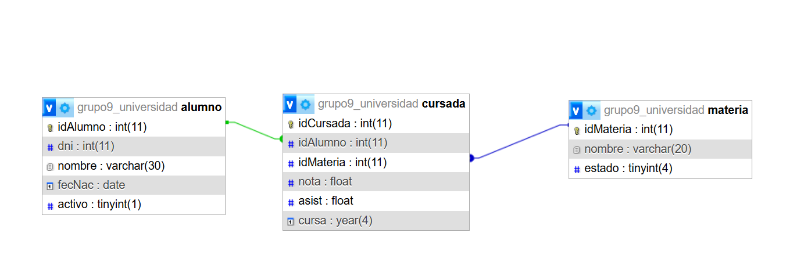

# SGULP – Sistema de Gestión para la Universidad de La Punta

**Proyecto Transversal – Laboratorio 1 – Grupo 9**

Sistema de escritorio en Java para registrar alumnos, materias e inscripciones
(cursadas) de la Universidad de La Punta, con persistencia en MariaDB mediante JDBC.

---

## 👥 Integrantes – 1ra Entrega

| Apellido y Nombre             |
|-------------------------------|
| Magallanes, Franco            |
| Auriol, Jessica               |
| Martin Asis, Gonzalo Exequiel |
| Matijas, Omar                 |

---

## 📦 Contenido de la 1ra Entrega

| Requisito                     | Ubicación                             |
|-------------------------------|---------------------------------------|
| Script de la base de datos    | `GP9_universidad.sql`                 |
| Captura de la vista diseñador | `GP9_universidad_diseñador.png`       |
| Clase de dominio              | `modelo/Alumno.java`                  |
| Clase de conexión a MariaDB   | `persistencia/miConexion.java`        |
| Acceso a datos                | `persistencia/AlumnoData.java`        |
| Main con test de consola      | `vista/Grupo9_TRANSVERSAL_SGULP.java` |

---

## 🗄️ Base de datos

Base: **`grupo9_universidad`** (motor InnoDB)

```
alumno (1) ──< cursada >── (1) materia
```

| Tabla     | Descripción                                                             |
|-----------|-------------------------------------------------------------------------|
| `alumno`  | Datos del alumno: DNI, nombre, fecha de nacimiento y estado activo      |
| `materia` | Materias que se dictan y su estado                                      |
| `cursada` | Inscripción de un alumno a una materia en un año, con nota y asistencia |

`cursada` tiene claves foráneas hacia `alumno` y `materia`.



---

## ▶️ Cómo ejecutar

### Requisitos

- JDK 17 o superior
- Apache NetBeans (proyecto Maven)
- XAMPP con MariaDB/MySQL iniciado

### Pasos

1. Iniciar **MySQL** desde el panel de XAMPP.
2. En phpMyAdmin → **Importar** → seleccionar `GP9_universidad.sql`.
3. Abrir el proyecto en NetBeans.
4. Si MariaDB usa un puerto distinto a `3306` (por ejemplo `3307`), cambiar la
   constante `PORT` en `vista/Grupo9_TRANSVERSAL_SGULP.java`.
5. Ejecutar con **Run Project** (`F6`).

### Resultado esperado

Al ejecutar, el programa se conecta a la base, ingresa a los integrantes del grupo
(solo si la tabla `alumno` está vacía) y los muestra por consola:

```
Franco Magallanes (DNI 34421846)
Jessica Auriol (DNI 34877066)
Gonzalo Exequiel Martin (DNI 35915707)
Omar Matijas (DNI 30334915)
```

---

## 🧱 Estructura del proyecto

```
src/main/java/com/mycompany/grupo9_transversal_sgulp/
├── modelo/          → Alumno, Materia, Cursada
├── persistencia/    → miConexion, AlumnoData, MateriaData
└── vista/           → Grupo9_TRANSVERSAL_SGULP (main con test de consola)
```

---

## 🛠️ Tecnologías

- Java 17
- Maven
- MariaDB (XAMPP) + driver JDBC `mariadb-java-client`
